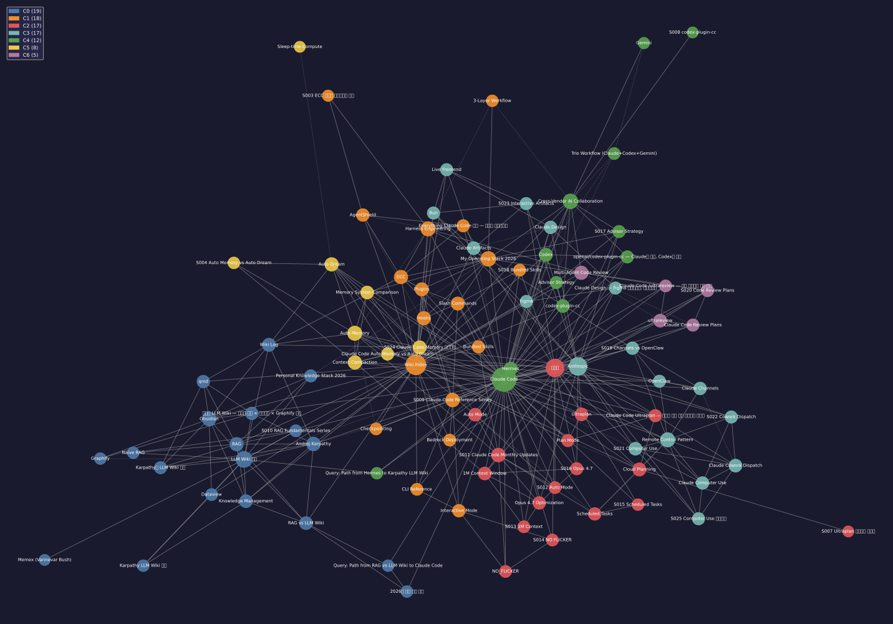

# Obsidian LLM Wiki Setup — Shareable Config Bundle

🌏 [한국어](./README.md) · **English**



> The image above is the 08_Hub LLM Wiki built with this setup, rendered by **graphify** (96 nodes · 7 communities). Colors = communities (topic clusters), lines = links between notes. An example of what this setup produces.

Replicate this Obsidian setup: Karpathy's **LLM Wiki pattern** + PARA folders + Claude Code integration.
Includes the **plugin list + core/theme settings + per-plugin settings for 18 plugins + templates + LLM Wiki schema** → roughly **95% identical** replication. **Only API keys, certs, and personal data are removed** (each user adds their own keys).

## 📦 What's inside

```
obsidian-llm-wiki-setup/
├── README.md / README.en.md       # intro (KO / EN)
├── GUIDE.md / GUIDE.en.md         # full setup guide (KO / EN)
├── plugins.txt                    # 31 community plugin IDs
├── LLM-Wiki-CLAUDE.example.md     # LLM Wiki schema example (the 07/08 CLAUDE.md)
├── templates/                     # 3 Templater templates (daily/research/trend)
├── assets/graph-08hub.svg         # knowledge-graph preview
└── .obsidian/
    ├── community-plugins.json     # enabled community plugins
    ├── core-plugins.json          # core plugin on/off
    ├── appearance.json            # theme (Blue Topaz) + CSS snippets
    ├── app.json · daily-notes.json · types.json   # core settings
    ├── snippets/                  # 2 CSS snippets
    └── plugins/<18>/data.json     # per-plugin settings (secret-free only)
```

Per-plugin settings included (18): dataview · tasks · linter · templater · auto-note-mover · icon-folder · calendar · admonition · minimal-settings · canvas-mindmap · omnisearch · excalidraw · terminal · open-in-terminal · homepage · table-editor · smart-connections · brat

## 🚫 Intentionally excluded (secrets / personal) — only 5

| Excluded | Reason | Your action |
|---|---|---|
| `gemini-assistant` · `obsidian-local-rest-api` · `copilot` data.json | **real API keys / certs** | add your own keys |
| `obsidian42-brat` included but PAT blanked | GitHub token emptied | add PAT if needed |
| `hermes-console` · `cc-obsidian` data.json | personal session/chat data | (optional plugins) |
| `workspace*.json` · `graph.json` · `bookmarks.json` · `hermes/` | personal layout/coords/bookmarks | auto-generated |

→ Most settings are **already included**; you only add your own keys to the 3 AI plugins above.

## 🛠 Installation

### 1) Install Obsidian + create a new vault
https://obsidian.md

### 2) Enable community plugins
Settings → Community plugins → "Turn off restricted mode" → Browse and install each ID from `plugins.txt`.
(Use `obsidian42-brat` for beta/unlisted plugins.)

**Minimal core 6 to start**: `dataview` · `templater-obsidian` · `obsidian-git` · `obsidian-clipper` · `smart-connections` · `omnisearch`

### 3) Apply settings
Copy the `.obsidian/` json files from this bundle into your new vault's `.obsidian/`, then restart Obsidian.
⚠️ This overwrites the new vault's `.obsidian/` — best done on an empty vault.

### 4) Theme
Settings → Appearance → Themes → install **Blue Topaz**. Put the 2 css files from `snippets/` into your vault's `.obsidian/snippets/` and enable them.

### 5) Folders + LLM Wiki
Follow the "Replication checklist" in [`GUIDE.en.md`](./GUIDE.en.md) — 9 steps (folders → LLM Wiki CLAUDE.md → CLI tools → first cycle).

### 6) CLI tools (optional, for the AI workflow)

**macOS / Linux**
```bash
pip install graphifyy          # (or pip3) knowledge-graph visualization
npm install -g @tobilu/qmd     # local markdown search engine
```
**Windows (PowerShell)**
```powershell
py -m pip install graphifyy    # or python -m pip install graphifyy
npm install -g "@tobilu/qmd"
```
> NotebookLM integration via `nlm` (optional, same on all OS).

## 🔄 The core workflow

| Stage | Tool | What it does |
|------|------|--------------|
| Capture | `obsidian-clipper` (5 templates) | clip web/youtube/paper/book/podcast into `raw/` (with a purpose note = Gold In) |
| Organize | Claude Code `/wiki-ingest` | raw → wiki pages + cross-refs + index/log update |
| Query | `/wiki-query` + `smart-connections` | synthesize answers from the wiki, file good answers back |
| Lint | `/wiki-lint` | check broken links, orphans, duplicates, stale notes |
| Search | `qmd` + `qmd-as-md-obsidian` | local markdown search index |
| Visualize | `graphify` | vault → knowledge graph (HTML/JSON/report) |
| External access | `obsidian-local-rest-api` + `mcp-tools` | let AI agents read/write the vault |

> Key discipline **Gold In, Gold Out**: only ingest what you noted a *purpose* for. No-intent data is noise.

## 🖥 OS notes (macOS · Windows · Linux)

Obsidian, plugins, themes, and `.obsidian/*.json` are **identical across all three OSes**. Only these differ:

| Item | macOS | Windows | Linux |
|------|-------|---------|-------|
| Show `.obsidian/` folder | Finder `⌘⇧.` | Explorer → View → check "Hidden items" | File manager `Ctrl+H` |
| Run Python | `pip` / `pip3` | `py -m pip` | `pip3` |
| Copy config | Finder drag or `cp` | Explorer drag or `copy` | file manager drag or `cp` |
| Terminal | Terminal/iTerm (zsh) | PowerShell | bash/zsh |

- **`.obsidian/` location**: always **inside your vault folder** (`<your-vault>/.obsidian/`), regardless of OS. It's hidden — reveal it as above, then overwrite with this bundle's files.
- **Easiest path (no CLI)**: install plugins inside Obsidian (step 2) + copy settings via file manager (step 3). The CLI tools (graphify, qmd) are **optional**, only for AI automation.
- For `obsidian-git` on Windows, install Git for Windows (https://git-scm.com). macOS: Xcode CLT. Linux: `apt/dnf install git`.

## 🐙 Push to GitHub (already done here)

```bash
gh repo create obsidian-llm-wiki-setup --public --source=. --push
```
`.gitignore` auto-excludes secret files, so even if you later copy your full `.obsidian/`, keys won't leak.

## 📄 License

MIT — free to use, modify, redistribute. See [LICENSE](./LICENSE).

---
Source: extracted from a real vault `.obsidian` config (2026-05-31), secrets stripped.
